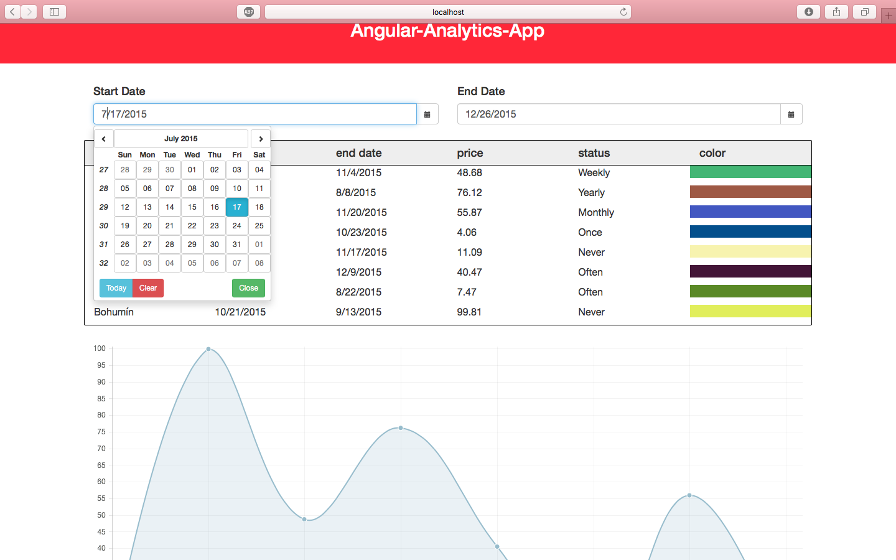

# Angular-Analytics-App

It helps to analyze data

## Build 

npm install  

bower install

gulp

# How to use

Use date pickers to filter the object by date range.
Chart will show the cities and their prices. Table and chart depends
upon the date filter.

## Result

 

